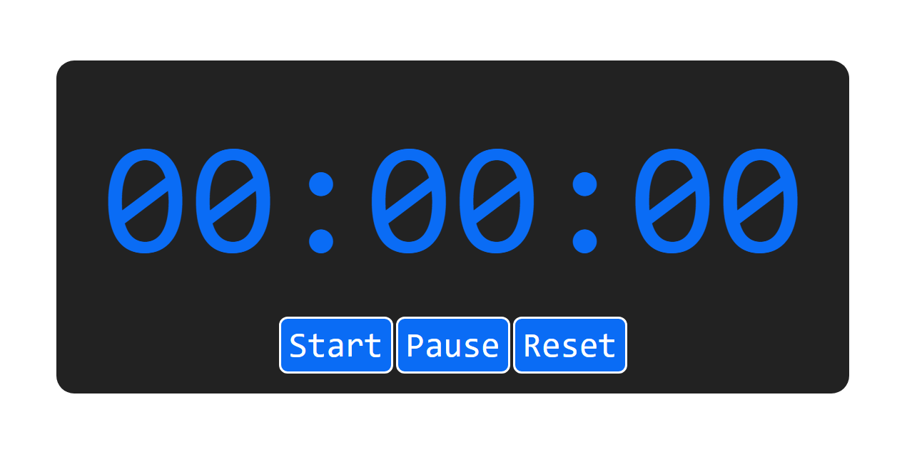
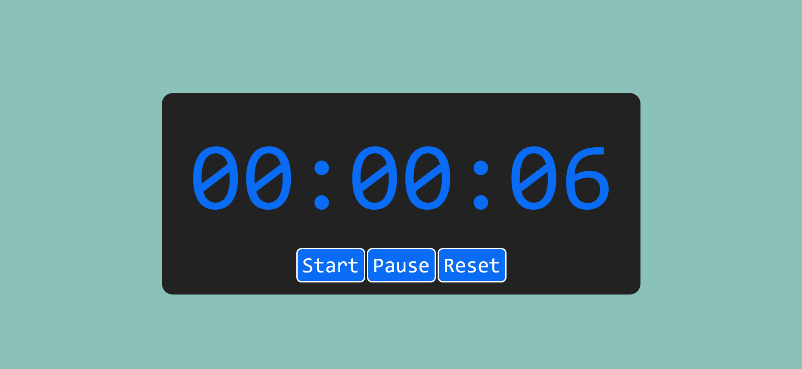
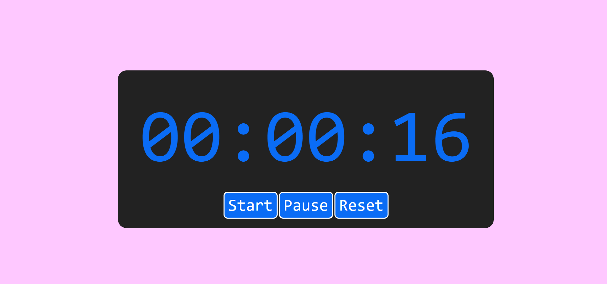

# Chore Helper

**Chore Helper** is a cute and simple stopwatch app designed to keep track of time while you do... whatever it is you're supposed to be doing. Bonus: it changes background color based on how long you've been going!

##  Features

- Start, pause, and reset a timer
- Tracks hours, minutes, and seconds
- Background color shifts based on time:
  - After 5 seconds →  teal-ish 
  - After 15 seconds →  soft pink 
- Fully built using HTML, CSS, and JavaScript

## Screenshots

##  How It Works

- Click `Start` to begin tracking time.
- Click `Pause` to stop the timer temporarily.
- Click `Reset` to clear the timer and color changes.
- After 5 seconds: background changes to teal.
- After 15 seconds: background changes to soft pink.

##  Why This Exists

Made as a practice project while learning how to manipulate the DOM, handle intervals, and make interactive UI elements with plain JavaScript.
Little timers make big habits. Keep going, you're doing great!
